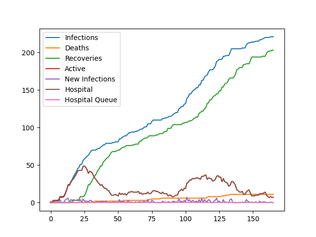

# #WirvsVirus
Our repository for the German [WirVsVirus hackathon](https://wirvsvirushackathon.org).

To install this, run
```
$ git clone https://github.com/miltfra/wirvsvirus.git
```

To follow the rest of the instructions `cd` into the directory:
```
$ cd wirvsvirus
```

## Structre

This project include two parts.

1. PANSIM - A simulation that provides data on a theoretical development of a pandemic.
2. PANVIS - A visualizer for the data on the development of a pandamic.


## Backend (PANdemic SIMulation)

**Author: Franz Miltz**

The recommended backend was written in Rust. You can find it in `src/pansim`. 

### Demo

Here you can see three different scenarios. You can find more details in `demo/`.




Keep an eye on the value on the axis. 
You can see that the fast pandemic is indeed faster - in regards to start and end.
Additionally it's obvious that the infection rate starts to escalate as soon as the hospitals are overfull.

The slow pandemic does not reach that limit and is thus relatively contained.

The unsustained pandemic can't take off. 
It dies way quicker than the slow pandemic and does not reach more than a few hundred total infections.

### Dependencies 

- Rust
- Python (Pandas)

### Usage

To run the simulation, do the following:
```
$ cd src/pansim
$ cargo run --release Config.toml
```

Or alternatively, you can use the `run.sh` script to run the project and generate visualizations that may then be founnd in the `output/` folder, next to the `.csv`-file. All the output files are named with a time stamp.

You can change the settings in `src/pansim/Config.toml` to your liking but all settings must be included.


### Features

- efficient simulation of more than 10 million people
- full customizability through `Config.toml`
- social structure through groups (households, districts, cities) levels of connectedness
- random relations between people in households
- health system with capacity per city
- lethality based on treatment
- spread based on quarantine

### Caveats

- based on no scientificly researched model
- simulation of every single person is unfeasible, therefore some abstractions are being made
- data for lethality, effectivity of treatment and mobility between social groups is unknown and undeterminable

### TODO

- behaviour changes
- apparent statistics
- unit and integration testing
- exposing usable public api

## Frontend (PANdemic VISualization)

**Author: Richard Schiemenz**

The frontend was written in Javascript using Electron.

You can find it in `src/panvis`. To run it, do the following:
```
$ cd src/panvis
$ npm install
$ npm start
```
The file visualized can be found in `src/panvis/data.csv`. It can be exchanged to visualize differend developments of the virus.
